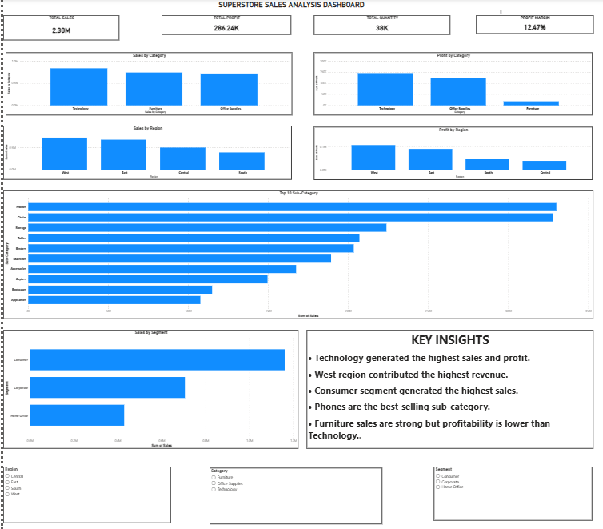

# Superstore Sales Analysis Dashboard

## Project Overview

This project analyzes Superstore sales data using Excel, Python, SQL concepts, and Power BI.

The objective is to identify sales trends, profitable categories, top-performing regions, and customer segment performance.

---

## Tools Used

- Excel
- Python
- Pandas
- Matplotlib
- Power BI

---

## Key Insights

- Technology generated the highest sales.
- Technology generated the highest profit.
- West region generated the highest revenue.
- Phones are the top-selling sub-category.
- Consumer segment generated the highest sales.

---

## Dashboard Preview



---

## Project Structure

```text
Superstore-Sales-Analysis
│
├── Dataset
├── Excel
├── Python
├── PowerBI
├── Images
└── README.md
```

---

## Author

Pranav Shinde
